# Final Prompt Recommendations

## ✅ Recommended Prompts to Retain

### **Universal Principles** (Project-Agnostic)

**`prompts/tdd_principles.md`** `#tdd #universal #quality`
- Universal test-driven development cycle, testing hierarchy, and quality standards

**`prompts/quality_gates.md`** `#quality #universal #ci`  
- Universal quality standards, automated checks, and performance targets for any project

**`prompts/git.md`** `#git #universal #workflow`
- Universal Git practices, commit conventions, and version control collaboration patterns

### **Technology-Specific** (Stack Adapters)

**`prompts/elixir.md`** `#elixir #language #patterns`
- Elixir language fundamentals, pattern matching, OTP, error handling, and testing patterns

**`prompts/phoenix.md`** `#phoenix #web #liveview`
- Phoenix framework patterns, LiveView architecture, authentication, routing, and HEEx templates

**`prompts/llms.md`** `#llms #ai #prompts #context`  
- LLM interaction guidelines, prompt engineering, context management, and AI collaboration patterns

### **Project Methodology** (Build Characteristics)

**`prompts/mvp_development.md`** `#mvp #methodology #early-stage`
- MVP development philosophy, anti-patterns to avoid, early-stage decision making, and scaling transitions

**`prompts/greenfield_project.md`** `#greenfield #new-project #architecture`
- New project development characteristics, technology selection, clean architecture, and process establishment

### **Workflow & Process** (EatFair-Specific Applications)

**`prompts/prioritize_work.md`** `#prioritization #eatfair #mvp`
- EatFair-specific work prioritization system applying MVP principles to food platform development

**`prompts/start_feature_development.md`** `#development #eatfair #tdd`
- Auto-determines next work item and applies TDD+Phoenix+MVP principles for EatFair development

**`prompts/process_feedback.md`** `#feedback #eatfair #systematic`
- Comprehensive feedback processing for manual testing results and UX improvements in food platform context

**`prompts/validate_and_fix_tests.md`** `#testing #validation #tdd`
- Systematic test validation and debugging using TDD principles with Phoenix/Elixir patterns

**`prompts/sync_documentation.md`** `#documentation #sync #validation`
- Documentation sync system ensuring PROJECT_IMPLEMENTATION.md reflects actual code state and spec compliance

### **Collections & References** (Comprehensive Guidance)

**`prompts/development_prompts.md`** `#prompts #collection #reference`
- Comprehensive collection of development task templates that references all modular prompts

**`prompts/software_development_lifecycle.md`** `#lifecycle #eatfair #workflow`
- EatFair-specific development workflow implementing universal principles for food platform

### **Navigation & Coordination**

**`AGENTS.md`** `#agents #navigation #tags`
- Central tag-based prompt routing system and agent coordination for comprehensive navigation

**`WARP.md`** `#warp #terminal #entry`
- Warp terminal entry point with quick navigation and tag usage examples

---

## 🔄 Content That Was Redistributed (Not Lost)

### From `software_development_lifecycle.md`:
- **TDD Philosophy** → `tdd_principles.md` (universal principles)
- **Quality Standards** → `quality_gates.md` (universal quality gates)
- **Git Workflow** → `git.md` (universal version control)
- **Phoenix Patterns** → `phoenix.md` (technology-specific guidance)

### From `prioritize_work.md`:
- **MVP Principles** → `mvp_development.md` (project methodology)
- **Decision Framework** → `mvp_development.md` (early-stage characteristics)
- **Anti-patterns** → `mvp_development.md` (what to avoid in MVP)

### From `documentation/phoenix_elixir_reference.md`:
- **Elixir Language** → `elixir.md` (language-specific patterns)
- **Phoenix Framework** → `phoenix.md` (web framework guidance)
- **Technical Patterns** → Distributed appropriately

## 🗑️ Content That Didn't Make the Cut

### **None - All Content Preserved**
- **Philosophy**: Every piece of existing content has been preserved and relocated to appropriate categorical files
- **Enhancement**: Content has been enhanced with proper tagging and cross-references
- **Modularity**: Universal principles extracted for reuse across projects

## 📊 Final Prompt Ecosystem Structure

```mermaid
graph TD
    %% Entry Points
    WARP[WARP.md<br/>Terminal entry point] --> AGENTS[AGENTS.md<br/>Tag-based navigation hub]
    
    %% Universal Foundation (Reusable)
    AGENTS --> TDD[tdd_principles.md<br/>Universal TDD cycle]
    AGENTS --> QUALITY[quality_gates.md<br/>Universal quality standards]
    AGENTS --> GIT[git.md<br/>Universal version control]
    
    %% Technology Stack (Elixir/Phoenix)
    AGENTS --> ELIXIR[elixir.md<br/>Language patterns]
    AGENTS --> PHOENIX[phoenix.md<br/>Web framework patterns]
    AGENTS --> LLMS[llms.md<br/>AI interaction guidelines]
    
    %% Project Methodology (Build Characteristics)
    AGENTS --> MVP[mvp_development.md<br/>Early-stage methodology]
    AGENTS --> GREENFIELD[greenfield_project.md<br/>New project characteristics]
    
    %% EatFair-Specific Workflows
    AGENTS --> PRIORITIZE[prioritize_work.md<br/>Food platform prioritization]
    AGENTS --> DEVELOP[start_feature_development.md<br/>Auto-determined development]
    AGENTS --> FEEDBACK[process_feedback.md<br/>Systematic issue resolution]
    AGENTS --> TESTING[validate_and_fix_tests.md<br/>Test validation & debugging]
    AGENTS --> SYNC[sync_documentation.md<br/>Documentation discipline]
    
    %% Collections
    AGENTS --> DEV_PROMPTS[development_prompts.md<br/>Comprehensive prompt collection]
    AGENTS --> LIFECYCLE[software_development_lifecycle.md<br/>EatFair development workflow]
    
    %% References
    TDD -.-> DEVELOP
    TDD -.-> FEEDBACK
    TDD -.-> TESTING
    QUALITY -.-> SYNC
    PHOENIX -.-> TESTING
    MVP -.-> PRIORITIZE
    MVP -.-> DEVELOP
```

## 🎯 Key Benefits Achieved

### **1. True Modularity**
- **Universal Principles**: Can be used in Django, Rails, or any other project
- **Technology Adapters**: Elixir/Phoenix patterns isolated and reusable
- **Project Methodology**: MVP vs Enterprise approaches clearly separated
- **Product Domain**: EatFair-specific logic stays in documentation/

### **2. Organic Navigation**
- **Tag-Based Discovery**: `#tdd #phoenix #mvp` provides composed guidance
- **Free-Form References**: No rigid folder structure constrains thinking
- **Natural Evolution**: New prompts integrate seamlessly via tagging

### **3. No Content Loss**
- **100% Preservation**: Every line of original content maintained
- **Enhanced Value**: Content now properly categorized and cross-referenced
- **Better Accessibility**: Universal principles easily discoverable

### **4. Clean Architecture**
- **Acyclic Dependencies**: Clear foundation → application → navigation layers
- **Separation of Concerns**: Each prompt has single, focused responsibility
- **Composable Guidance**: Multiple tags combine for comprehensive help

## 🚀 Usage Examples

**Single Tag**: `"Help me with #tdd for user authentication"`
- Routes to `tdd_principles.md` for universal TDD guidance

**Multiple Tags**: `"Implement restaurant search using #tdd #phoenix #mvp"`
- Combines TDD principles + Phoenix patterns + MVP methodology

**Workflow Tag**: `"Use #prioritization to determine next work"`
- Routes to EatFair-specific prioritization system with MVP context

**Technology Tag**: `"Debug LiveView issue with #phoenix patterns"`
- Routes to Phoenix-specific guidance including LiveView best practices

---

**✅ RECOMMENDATION: RETAIN ALL LISTED PROMPTS**

This modular prompt ecosystem achieves your vision of "ports and adapters for prompts" while preserving all existing functionality and enabling seamless reuse across different projects and technology stacks.
