# Prompt Dependency Graph

This document visualizes the reference relationships between all prompts and documentation files. The graph shows how agents navigate between different guidance systems.

## Graph Structure

**Legend:**
- `→` indicates "references" or "depends on"
- **Bold** items are entry points (commonly accessed directly)
- *Italic* items are foundational (referenced by multiple other files)

## Dependency Graph

```mermaid
graph TD
    %% Entry Points
    WARP[WARP.md] --> AGENTS[AGENTS.md]
    AGENTS --> |"tag routing"| ALL_PROMPTS[All Prompts]
    
    %% Universal Principles (Referenced by Multiple)
    TDD[tdd_principles.md] 
    QUALITY[quality_gates.md]
    GIT[git.md]
    
    %% Technology Specific
    ELIXIR[elixir.md]
    PHOENIX[phoenix.md]
    LLMS[llms.md]
    
    %% Project Methodology
    MVP[mvp_development.md]
    GREENFIELD[greenfield_project.md]
    
    %% Workflow & Process
    PRIORITIZE[prioritize_work.md]
    FEEDBACK[process_feedback.md]
    SYNC[sync_documentation.md]
    TESTING[validate_and_fix_tests.md]
    DEVELOPMENT[start_feature_development.md]
    
    %% Comprehensive Collections
    DEV_PROMPTS[development_prompts.md]
    LIFECYCLE[software_development_lifecycle.md]
    
    %% Documentation
    PROD_SPEC[product_specification.md]
    BACKLOG[backlog_dashboard.md]
    ADR[architectural_decision_records.md]
    PHOENIX_REF[phoenix_elixir_reference.md]
    
    %% Dependencies
    LIFECYCLE --> |"references universal principles"| TDD
    LIFECYCLE --> |"references quality standards"| QUALITY
    LIFECYCLE --> |"references version control"| GIT
    LIFECYCLE --> |"EatFair-specific workflow"| PROD_SPEC
    
    DEVELOPMENT --> |"uses TDD approach"| TDD
    DEVELOPMENT --> |"applies quality gates"| QUALITY
    DEVELOPMENT --> |"references methodology"| MVP
    
    PRIORITIZE --> |"applies MVP principles"| MVP
    PRIORITIZE --> |"references product goals"| PROD_SPEC
    PRIORITIZE --> |"updates backlog"| BACKLOG
    
    FEEDBACK --> |"applies TDD for fixes"| TDD
    FEEDBACK --> |"ensures quality"| QUALITY
    FEEDBACK --> |"updates documentation"| SYNC
    
    TESTING --> |"applies TDD principles"| TDD
    TESTING --> |"ensures quality gates"| QUALITY
    TESTING --> |"uses Phoenix patterns"| PHOENIX
    
    DEV_PROMPTS --> |"collection references"| TDD
    DEV_PROMPTS --> |"collection references"| QUALITY
    DEV_PROMPTS --> |"collection references"| FEEDBACK
    DEV_PROMPTS --> |"collection references"| SYNC
    
    SYNC --> |"validates against spec"| PROD_SPEC
    SYNC --> |"updates project status"| BACKLOG
    
    %% Documentation dependencies
    AGENTS --> |"technical patterns"| PHOENIX_REF
    WARP --> |"references project docs"| BACKLOG
    WARP --> |"references product vision"| PROD_SPEC
```

## Reference Matrix

| From File | To File | Relationship | Reason |
|-----------|---------|--------------|--------|
| **WARP.md** | AGENTS.md | navigation | Primary agent coordination |
| **AGENTS.md** | All prompts | tag-routing | Tag-based prompt directory |
| software_development_lifecycle.md | tdd_principles.md | foundation | Universal TDD concepts |
| software_development_lifecycle.md | quality_gates.md | foundation | Universal quality standards |
| software_development_lifecycle.md | git.md | foundation | Version control practices |
| start_feature_development.md | tdd_principles.md | methodology | TDD implementation approach |
| start_feature_development.md | mvp_development.md | context | MVP-appropriate development |
| prioritize_work.md | mvp_development.md | methodology | MVP prioritization principles |
| prioritize_work.md | product_specification.md | validation | Business requirements alignment |
| process_feedback.md | tdd_principles.md | implementation | TDD-based issue resolution |
| process_feedback.md | quality_gates.md | validation | Quality assurance in fixes |
| validate_and_fix_tests.md | tdd_principles.md | foundation | Test-driven debugging |
| validate_and_fix_tests.md | phoenix.md | technology | Phoenix-specific test patterns |
| development_prompts.md | Multiple | collection | References various specialized prompts |
| sync_documentation.md | product_specification.md | validation | Spec compliance checking |

## Entry Points and Navigation Flow

### 1. **WARP.md** (Terminal Entry Point)
- **Purpose**: Warp terminal-specific guidance and quick navigation
- **References**: AGENTS.md for comprehensive navigation
- **Scope**: Terminal usage, basic project orientation

### 2. **AGENTS.md** (Central Navigation Hub)
- **Purpose**: Tag-based prompt routing and agent coordination
- **References**: All prompts via tag system
- **Scope**: Complete prompt ecosystem navigation

### 3. **Direct Prompt Access**
Users can access prompts directly using tags:
- `#tdd` → Universal TDD principles
- `#phoenix` → Phoenix framework guidance
- `#mvp` → MVP development methodology
- `#feedback` → Systematic feedback processing

## Acyclic Validation

The dependency graph is **acyclic** as designed:

**Foundation Layer** (No dependencies):
- tdd_principles.md
- quality_gates.md  
- git.md
- elixir.md
- phoenix.md
- llms.md
- mvp_development.md
- greenfield_project.md
- product_specification.md

**Application Layer** (References foundation):
- software_development_lifecycle.md
- start_feature_development.md
- process_feedback.md
- validate_and_fix_tests.md
- prioritize_work.md
- sync_documentation.md

**Navigation Layer** (References application):
- AGENTS.md (routes to all prompts)
- development_prompts.md (collects prompts)

**Entry Layer** (References navigation):
- WARP.md (references AGENTS.md only)

## Tag-Based Navigation Benefits

1. **Orthogonal Access**: Each prompt can be accessed independently
2. **Compositional Guidance**: Multiple tags provide combined guidance
3. **Free-Form Discovery**: Users discover relevant prompts naturally
4. **No Rigid Structure**: Organic reference patterns emerge
5. **Flexible Growth**: New prompts integrate seamlessly

---

*This graph represents the current state after prompt modularization. The tag-based system in AGENTS.md enables flexible, organic navigation while maintaining clear dependency relationships.*
